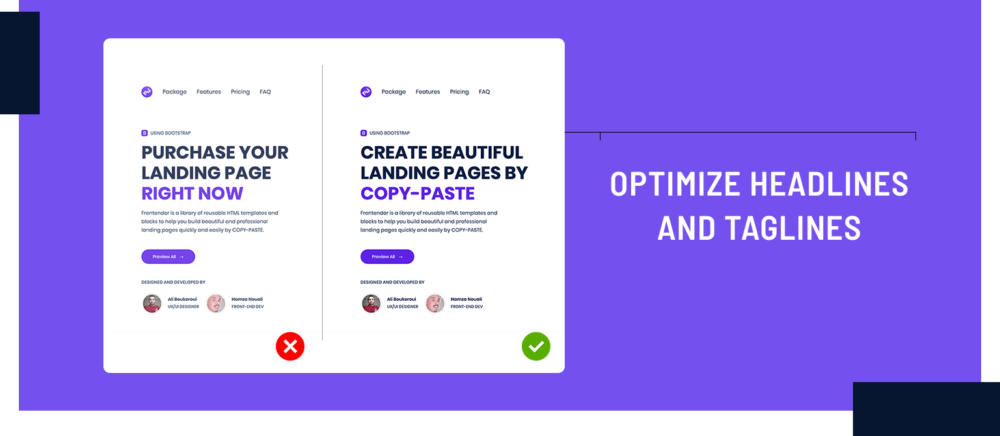
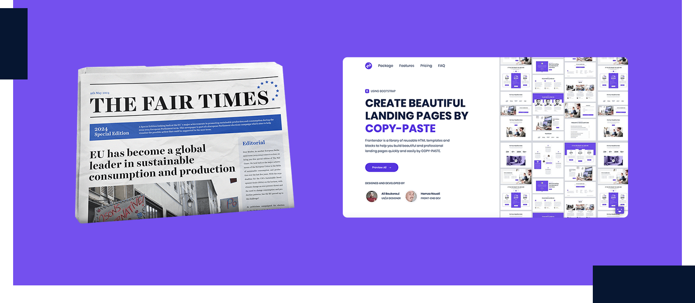
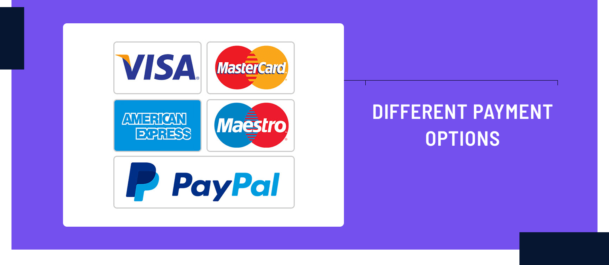

## What is a Landing Page?

A landing page is a common asset and standalone web page, created specifically for an advertising or marketing campaign. It’s where a visitor lands after they click on a link in an email, or from Google, Bing, Instagram, Twitter, YouTube, Facebook,  or similar places on the web.

Let's get this out of the way. Your homepage is not a landing page nor a place to show off your creativity. Design and creativity are important, of course, but function and content are the real reasons people come and stick around. let this sink all the way in and don’t ever forget it.

That said, let’s jump to 11 Best Practices for optimizing a landing page :

## 1. Optimize headlines and taglines

Your landing pages have to be very clear about your product and attract your visitor’s attention from the start. People’s attention span is just about [8 - 9 seconds,](http://www.quicksprout.com/2013/08/08/this-is-your-brain-on-visualization/) so you have to make sure you tell all the important stuff first and tell it as fast as possible to get more clicks, sales, and conversions.

## 2. Keep all important information above the fold

The word “above the fold” it more often describes what’s visible on a screen before scrolling down. It’s valuable and you will want to make the most of it. Make sure you have landing page elements that will convince your potential customers to convert. Such :

-   A clear headline
-   A clear value proposition ( tagline )
-   A clear CTA
-   An optimized form

## 3. Different payment options

Nowadays, landing pages needs to support the most common payment options. Many of your visitors might abandon their transactions if their preferred payment option isn’t or appears not to be available.

## 4. Choosing Monthly vs Annual Subscriptions

Customer retention is the most important key to profits. The lower barrier and flexibility to the entry of monthly subscription is crucial for acquiring new users, but you can’t deny that if customers bail out on your product services, you won’t see the money you need to survive, let alone prosper and grow your business.

Creating an annual subscription plan guarantees most of the customers will be around for at least 12 months. That’s a big step up in customer lifetime value, and you will have more time to engage with the customer and ensure the fulfillment of the product was successful.

This is an awesome opportunity to get paid for months upfront, which will increase your cash flow and help you recover customer acquisition costs.

You should understand is that both plans benefit your business, and offering the customer a choice won’t necessarily harm your business. As long as you're clear with your pricing strategies and also in displaying a monthly and annual subscription options, the flexibility will ensure you can serve different buyers at different stages in the customer life cycle.

## 5. Include authentic social proof - Testimonials

No matter how good you think your offering is, including testimonials of satisfied customers can add an air of trust to your claims that even the best copy will lack.

>“ People suppose the actions of others reflect the correct behavior for a given situation.”

This means that people will try to copy the behavior of others. Another thing you can do is by showing how many other people have already used your product and your average rating.

## 6. Visual media (images, Gifs, and videos)

Visual Media has a significant impact on explaining your product further. Make sure to add visual media that really reflect the features, the pain that your product solves.

Sometimes images are worth a thousand words if that is the case then GIFs are worth even more. While not as massive in size or cost as compared to videos, GIFs effectively act as a big attractive element on your landing page.

## 7. Optimize your page loading speed

It is true that the visual media are very important, but you must be careful about your page loading speed. Especially this is one of the factors that your landing page appears on the first pages. Google recommends 5 seconds or less at 3G. So, make sure the faster your page loads the better.

>“  Based on this check-in, 85% of participants’ landing pages were slower than Google’s recommendation of 5 seconds or less at a 3G connection. That’s not good news. “

## 8.  A/B testing

Take your LPO further with A/B testing your landing pages, but be smart about it. When you see the traffic increases, test certain elements to see which helps boost your conversion rates. You might use heat maps such as Hotjar.

Be aware, you can’t and should not split test any elements on your landing page until you have a good amount of data. Running A/B tests without data is a recipe for failure.

You might use Google Analytics to measure the effectiveness of your landing pages.

## 9. Use contrasting colors

If you think that color is trivial as a contributing factor in your conversion rate, think again. Evidence indicates that color is more important than many people realize.

It is crucial to consider that customers place visual appearance and color above other factors when shopping. In fact, a whopping 85% of customers identify color as the primary reason for why they buy a product.

it is highly recommended that you maintain consistency in the use of your brand colors.

## 10. Pay great attention to design for devices

A huge number of people browsing on their smartphones. This means that interactivity will be more limited, and load times will crawl. So, you should give your visitors every possible opportunity to convert, no matter how they’re viewing your page.

You should ensure better performance by designing a mobile responsive landing page that adapts to these devices. CTAs made more visible, layouts can be shifted and images can be shrunk or removed entirely beaus none of the mentioned qualities are good for your mobile conversion rates,

## 11. Only ask for what you need

It is very important to collect information as possible about your lead. However, how much you ask for depends on several factors. You should be very careful not to disturb the users or make them bored with entering information.

If you think your landing page product depends on this information so much, you may try to focus on improving the UX of filling those inputs.